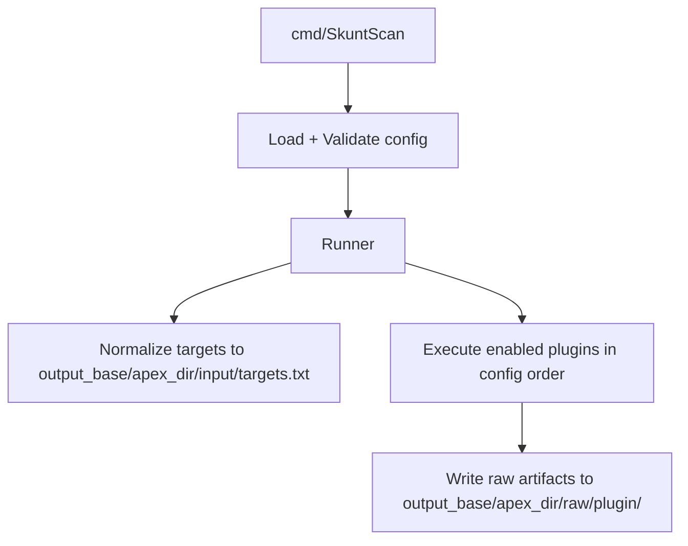
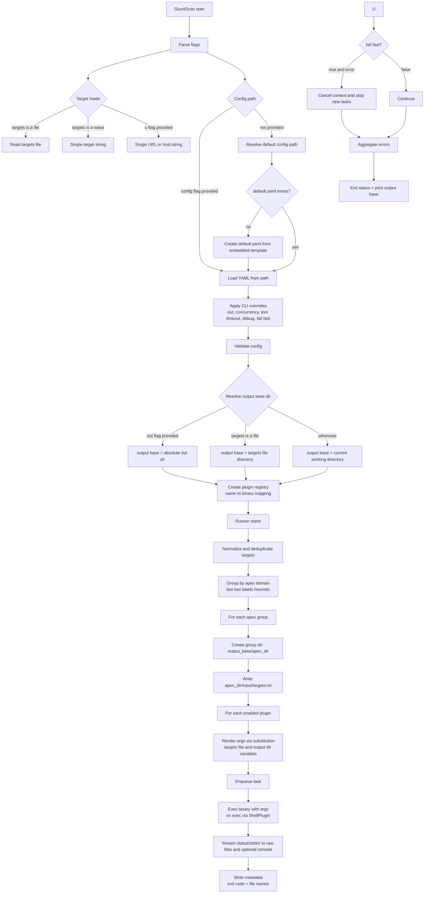
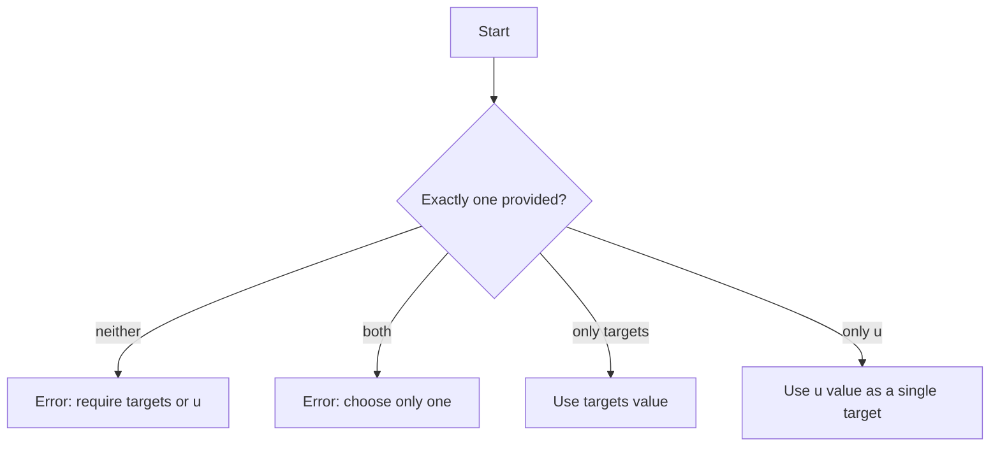
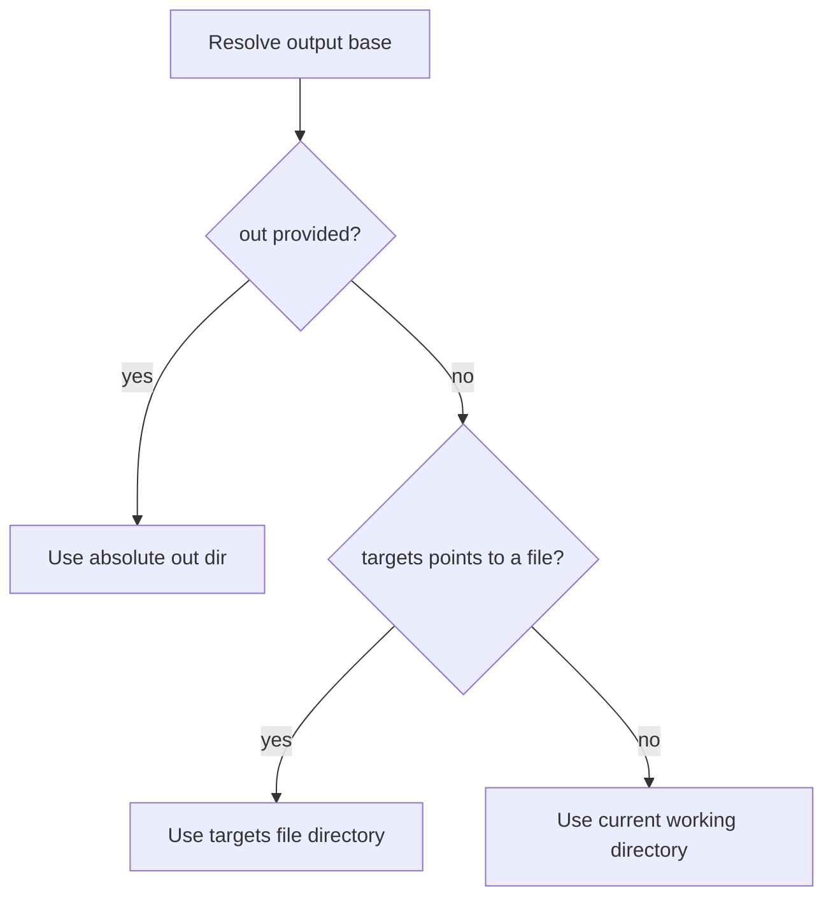
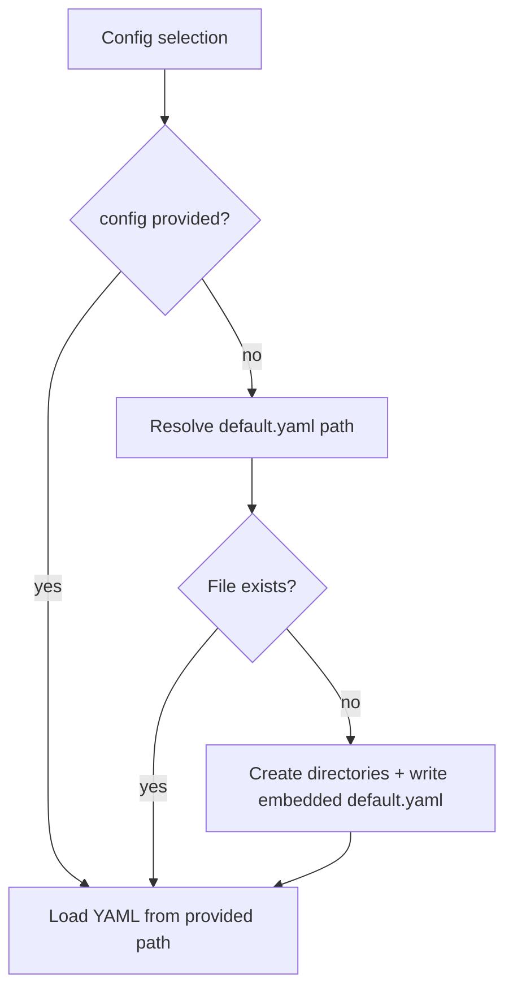
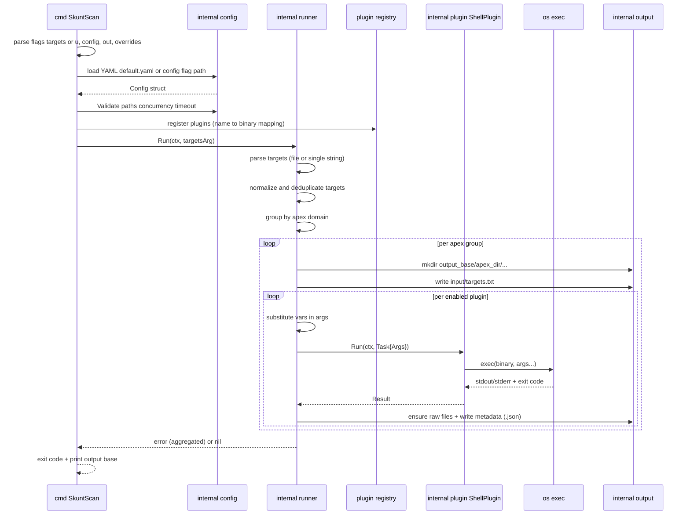

<br />
<div align="center">
  
  <h1 align="center">SkuntScan</h1>

  

  <br />
  <br />
  <a href="#quick-start">Quick Start</a>
  ·
  <a href="#configuration">Configuration</a>
  ·
  <a href="#architecture">Architecture</a>
  ·
  <a href="#security--legal">Security &amp; Legal</a>
  </p>
</div>

<details>
  <summary>Table of Contents</summary>
  <ol>
    <li><a href="#about">About</a></li>
    <li><a href="#highlights">Highlights</a></li>
    <li><a href="#quick-start">Quick Start</a></li>
    <li><a href="#installation">Installation</a></li>
    <li><a href="#configuration">Configuration</a></li>
    <li><a href="#custom-tools--flags">Custom Tools &amp; Flags</a></li>
    <li><a href="#output-layout">Output Layout</a></li>
    <li><a href="#architecture">Architecture</a></li>
    <li><a href="#documentation">Documentation</a></li>
    <li><a href="#development">Development</a></li>
    <li><a href="#extending-skuntscan">Extending SkuntScan</a></li>
    <li><a href="#roadmap">Roadmap</a></li>
    <li><a href="#security--legal">Security &amp; Legal</a></li>
    <li><a href="#license">License</a></li>
  </ol>
</details>

<h1 id="about">About</h1>

SkuntScan is a modular orchestrator for security recon and vulnerability scanning. It does not attempt to re-implement best-in-class tools (Subfinder, Amass, Httpx, Nuclei, etc.). Instead, it provides:

- A consistent execution model (timeouts, cancellation, deterministic tool ordering).
- A YAML-driven plugin system to define tools and flags.
- Deterministic on-disk artifacts (stdout/stderr + metadata per tool run).
- Linux-only runtime with predictable execution (enabled tool binaries must resolve to absolute Linux paths after env/user expansion).

<h1 id="highlights">Highlights</h1>

| Area | What You Get |
|------|--------------|
| Orchestration | Top-to-bottom tool order + optional per-tool timeouts + Ctrl+C cancellation |
| Configuration | YAML plugin list with explicit flags and optional enable/disable |
| Outputs | Per-apex output folders with raw artifacts under `<apex_dir>/raw/<plugin>/` |
| Platform | Linux-only Go binary; tools remain external dependencies |
| Extensibility | Add new tools by editing YAML; future native plugins are possible |

<h1 id="quick-start">Quick Start</h1>

1. Put targets in a file (one per line):

```text
example.com
sub.example.com
```

2. Build and run SkuntScan:

```bash
go build -o bin/SkuntScan ./cmd/SkuntScan
./bin/SkuntScan -targets ./targets.txt
```

On first run, if you did not pass `-config`, SkuntScan creates a default config at:

- `$XDG_CONFIG_HOME/SkuntScan/conf/default.yaml`, or
- `~/.config/SkuntScan/conf/default.yaml`

3. Inspect outputs next to your targets file (or in the current directory):

```text
./
  example_com/
    input/targets.txt
    raw/<plugin>/*.out
    raw/<plugin>/*.json
```

<h1 id="installation">Installation</h1>

## Requirements

| Requirement | Notes |
|------------|------|
| Go 1.21+ | Build and run the CLI |
| External tools | Install tools referenced in your config (e.g., `subfinder`, `httpx`, `nuclei`) |

## Build

```bash
go build -o bin/SkuntScan ./cmd/SkuntScan
```

## Install (Linux)

```bash
sudo install -m 0755 bin/SkuntScan /usr/bin/SkuntScan
```

## Run

```bash
SkuntScan -targets ./targets.txt
```

<h1 id="configuration">Configuration</h1>

SkuntScan reads configuration from YAML. If you do not provide `-config`, it uses:

- `$XDG_CONFIG_HOME/SkuntScan/conf/default.yaml`, or
- `~/.config/SkuntScan/conf/default.yaml`

Configuration files:

- default config: `~/.config/SkuntScan/conf/default.yaml`
- example configs in this repo: `configs/*.yaml`, `examples/conf/config.example.yaml`

Important behaviors:

- `enabled: false` skips a tool without removing it from the config.
- On Linux, enabled plugin `binary` values must resolve to an absolute path after env/user expansion (for example: `/usr/bin/nuclei` or `$HOME/go/bin/nuclei`).
- Plugins execute in the order they appear in `plugins:` (top to bottom).
- You can override timeouts per tool with `timeout_sec` (set to `0` to disable for that tool).
- Arguments support simple variables:
  - `{{targets_file}}` → current targets file (may be rewritten by producing tools)
  - `{{base_targets_file}}` → original `<output_dir>/<apex_dir>/input/targets.txt`
  - `{{targets_file_<tool>}}` → explicit targets file for a tool (example: `{{targets_file_subfinder}}`)
  - `{{stdout_file_<tool>}}` → stdout file path for the most recent run of a tool (example: `{{stdout_file_katana}}`)
  - `{{stderr_file_<tool>}}` → stderr file path for the most recent run of a tool (example: `{{stderr_file_katana}}`)
  - `{{output_dir}}` → absolute output directory for the current apex group
- Tools can optionally produce a new targets list for subsequent tools:
  - `produces_targets: true` means the tool's stdout is normalized and merged into the next targets file when it exits successfully.

## Regenerate Default Config

If you want to overwrite your on-disk default config with the latest embedded template:

```bash
SkuntScan -regen-default-config
```

## Selecting a Specific Config

```bash
SkuntScan -config ~/.config/SkuntScan/conf/allconfigs.yaml -targets ./targets.txt
```

## Single URL Mode

Use `-u` when you want to scan a single URL or host without a targets file:

```bash
SkuntScan -u https://example.com
```

<h1 id="custom-tools--flags">Custom Tools &amp; Flags</h1>

SkuntScan is designed so you can run your own tools with your own flags without changing the Go code.

## Add a Tool

Add an entry under `plugins:` in your config YAML:

```yaml
plugins:
  - name: mytool
    binary: /usr/bin/mytool
    enabled: true
    flags:
      - --input
      - "{{targets_file}}"
      - --output
      - "{{output_dir}}/reports/mytool.json"
      - --silent
```

How it works:

- `name` becomes the output folder name under `<apex_dir>/raw/<name>/`.
- `binary` must resolve to an absolute Linux path after env/user expansion for enabled plugins (example: `/usr/bin/mytool` or `$HOME/go/bin/mytool`).
- `flags` are passed as an argument vector (no shell interpretation).

## Use Custom Flags Safely

- Prefer one YAML item per argument token.
  - Good: `["--output", "file.json"]`
  - Avoid: `"--output file.json"` (works for some tools, but is easier to get wrong)
- If your tool needs quoting/escaping, handle it at the tool level (or invoke a shell explicitly as the binary).

## Disable Tools Without Removing Them

```yaml
  - name: noisy-tool
    binary: noisy-tool
    enabled: false
    flags: ["--whatever"]
```

<h1 id="output-layout">Output Layout</h1>

SkuntScan groups targets by apex domain (example: `test.example.com` → `example.com`) and creates one folder per group.

Folder naming replaces dots with underscores:

- `example.com` → `example_com`
- `domain.com` → `domain_com`

Artifacts are written under:

- `<output_dir>/<apex_dir>/input/targets.txt`: canonical targets list for that apex group
- `<output_dir>/<apex_dir>/raw/<plugin>/<task_id>.out`: captured stdout for that plugin run (streamed during execution)
- `<output_dir>/<apex_dir>/raw/<plugin>/<task_id>.err`: captured stderr for that plugin run (streamed during execution)
- `<output_dir>/<apex_dir>/raw/<plugin>/<task_id>.json`: metadata (exit code, file names, error presence)

<h1 id="architecture">Architecture</h1>

SkuntScan consists of a small set of focused packages:

- `internal/config`: YAML schema loading + validation
- `internal/plugin`: plugin interfaces + shell adapter
- `internal/runner`: orchestration engine
- `internal/output`: artifact persistence

## Execution Flow (High Level)



## Execution Flow (In-Depth)



## Control-Flow Details

### CLI Decision Tree (targets vs u)



### Output Directory Resolution



### Default Config Resolution



## Runtime Sequence (What Actually Runs)



<h1 id="documentation">Documentation</h1>

- [Architecture](docs/architecture/README.md)
- [Semantics](docs/semantics/README.md)
- [Configuration](docs/config/README.md)
- [Plugins](docs/plugins/README.md)
- [Error Model](docs/error_model/README.md)
- Changelogs: [changelogs/](changelogs/) (latest: [2026-01-31](changelogs/2026-01-31.md))

<h1 id="development">Development</h1>

## Tests

```bash
go test ./... -v
```

Unit tests are designed to run without installing third-party security tools.

<h1 id="extending-skuntscan">Extending SkuntScan</h1>

There are two main extension paths:

## 1) YAML-only (most common)

If you just want to run new tools or change flags, you only edit your config YAML. No Go changes required.

## 2) Implement a Custom Plugin in Go (advanced)

You can implement a native plugin (no subprocess) by implementing the `Plugin` interface in:

- `internal/plugin/plugin.go`

Then register it in the CLI:

- `cmd/SkuntScan/main.go`

This is useful when you want:

- A Go-native stage that writes canonical intermediate files (assets/resolved/alive/urls).
- Rich structured results and reporting without parsing shell output later.

See:

- `docs/plugins/README.md` for plugin lifecycle and patterns
- `docs/architecture/README.md` for system boundaries

<h1 id="roadmap">Roadmap</h1>

- Stage-aware pipeline (assets → resolved → alive → urls → scans)
- First-class intermediate artifacts and additional variables (e.g., `{{alive_file}}`)
- Structured reporting aggregation (JSON/SARIF/Markdown rollups)
- Optional retry policies and per-tool resource controls

<h1 id="security--legal">Security &amp; Legal</h1>

SkuntScan is intended for authorized security testing only.

- You are responsible for obtaining permission before scanning targets.
- Do not use this project for unauthorized access or disruption.
- External tools may generate network traffic; run responsibly and rate-limit where appropriate.
